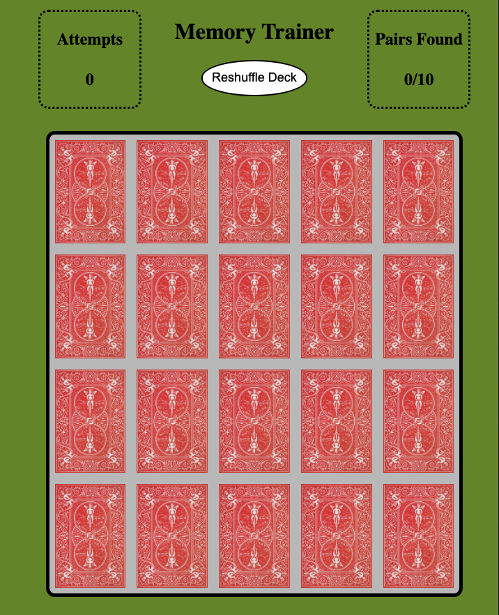

# Flashcards Memory Game
For this project I utilized DOM manipulation through Javascript to create an interactive [Memory Game](https://www.youtube.com/watch?v=492bM_dhdR4), where the user has to match pictures of different animals. 

### Technologies Used
- HTML
- Javascript
- CSS

### Link To Game
[Memory Game Live Site](https://pages.git.generalassemb.ly/jmusher/Flashcards-J.Musher/)

- Click on a card to begin testing your memory.
- Correctly match all 10 pairs to win the game.
- Click the reshuffle button to restart the game with in a new order.

No installation required.

### Final Product

### User Stories

- As a memory game user, I want to be presented with 20 cards in a random order, so that I am unaware of the location of the matching cards if playing the game repeatedly.
- As a memory game user, I want to have the game keep score of how many pairs i have gotten correct, so that i can see how well i am doing.
- As a memory game user, I want a congratulatory win screen when i complete the game, so that I can feel good about my accomplishment.
- As a memory game user, I want the game to keep track of my total guess attempts, so that I can see how accurate my guesses have been.
- As a memory game user, I want the game to have a reshuffle button, so that I can restart the game in a new random order without reloading the whole page.

### Initial Wire Frame

### Major Hurdles
- Getting the cards to randomize took a lot time and required researching on Google.
- Getting the size of the card's to stay uniform took a lot longer than expected.
- Getting the winscreen modal formatted correctly required a lot of tinkering.

### Unsolved Problems
- Still haven't been able to make the grid of cards not stretch beyond the window size.
- Ran out of time before being able to add in the timer I initially wanted.